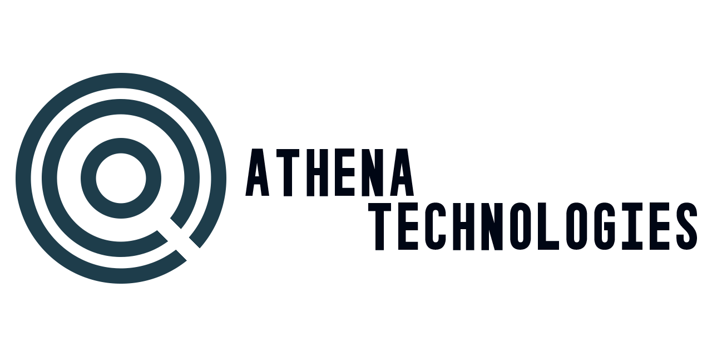

## **Project ATHENA**

Introducing the Adaptive Task Handling and Execution Neural Agent. 

made by **Elliot Waigh**

ATHENA is a modular, voice-enabled automation framework designed for local or cloud execution.  It integrates speech recognition (Vosk), intent recognition (TF-IDF hybrid context engine), and modular tool interfaces.

**ATHENA** uses a multi-stage processing pipeline:
1.Intent Recognition – TF-IDF + Entity Extraction hybrid model
2. Context Manager – Handles parameter collection & task continuation
3. Tool Invocation – Executes dynamically registered tools (e.g., lights, calendar, Spotify)

This will be ever evolving as a private project with the goal of automating most of my daily life operations.

When new systems and mechanics are developed, they will be implemented into the open source framework.

This being a private project, not meant for mass implementation is due to the sensitive data that will be stored within this automation project.

ATHENA Version History

**V4 — Modular Intelligence Overhaul**

- Complete refactor into a hybrid intent-processing system:

- Combines TF-IDF similarity, entity extraction, and context memory.

- Added automatic Tool Registration (tool_registry.py) with modular TOOL_SPEC definitions.

- Unified control interface for voice, text, and Telegram inputs.

- Rebuilt light control system using dynamic IP discovery and async handling.

- Implemented hybrid context memory, enabling ATHENA to recall missing parameters naturally.

- Cleaned codebase — deprecated redundant JSON files and isolated tool configuration to config/tools.json.

- Improved reliability with async-safe execution and auto context resolution.

**V3 — Voice, Entities, and Expansion**

- Added Vosk Speech Recognition for voice command input.

- Introduced the Entity Extractor for parsing devices, times, and contextual parameters.

- Integrated Telegram control, enabling remote command execution.

- Enhanced conversational flow with fallback logic between text and voice input.

**V2 — Contextual Core**

- Introduced the first multi-stage context queue system, allowing multi-turn conversations.

- Implemented basic intent recognition and structured response routing.

- Early modular architecture began forming under /Tools.

**V1 — Foundation Prototype**

- Built using Microsoft Bot Framework.

- Focused purely on text-based Q&A and simple rule responses.

- No persistence or local processing.