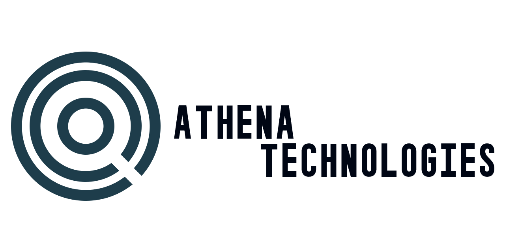

## **Project ATHENA**

Introducing the **Adaptive Task Handling and Execution Neural Agent**.  
Engineered by **Elliot Waigh**

ATHENA is an offline-first, locally hosted personal intelligence and automation framework designed for zero-data-leakage execution. It combines fine-tuned conversational intelligence, local tool execution, deterministic interpersonal memory, and two-way synchronization with an Obsidian markdown vault and local SQLite Knowledge Graph.

---

### **Architecture Overview**

ATHENA uses a dual-engine architecture separating fast conversational banter from factual memory ingestion:

1. **Front-End Conversational Engine (Qwen 2.5 3B LoRA):**
   * Handles immediate conversational context, multi-turn working memory, banter, and spoken responses.
   * Dispatches system and smart-home tool executions via dynamic tool manifests.
   * Runs natively on **Metal Performance Shaders (FP16)** on macOS and **BitsAndBytes (NF4 4-bit)** on CUDA/Windows.

2. **Zero-Loss Memory & Consolidation Pipeline (Qwen 2.5 7B Engine):**
   * **Intent Classification Router:** Classifies turns into `CHITCHAT`, `COMMAND`, `KNOWLEDGE_QUERY`, or `MEMORY_DEBRIEF` without rigid keyword lists.
   * **Atomic Turn Deconstruction:** Micro-prompts extract visited venues, contextual activity descriptions, recommendations, organizations, and human contacts.
   * **Interpersonal Loop Tracking:** Trigger-gated tracking of bilateral commitments, debts, and promises (`i_owe_them` vs. `they_owe_me`), with past-tense settlement recognition.
   * **Deterministic Clarification Gate:** Real-time database collision detection (e.g., distinguishing between contacts with shared first names) paired with semantic decision resolution (`AFFIRM`, `REJECT`, `SPECIFY`) that honors user refusals cleanly.
   * **Obsidian Vault & Knowledge Graph Persistence:** Programmatically synchronizes updates into structured Markdown notes (`Brain/People/`, `Brain/Places/`, `Brain/System/`) using explicit `[[Wikilinks]]`, atomic `triples`, and serialized database transactions.

---

### **ATHENA Version History**

#### **V5.1 — Dual-Engine Cognitive Pipeline & Personal Knowledge Graph** *(September 2026)*
* **Sub-Session Working Memory:** Expanded conversational buffer retaining rolling turns for real-time dialogue callbacks without touching disk.
* **Obsidian & SQLite Sync:** Replaced flat-file persistence with automatic updates to Obsidian markdown vaults (`Brain/People/`, `Brain/Places/`) and an offline SQLite triple-store (`athena.db`).
* **Deterministic Semantic Routing:** Implemented zero-shot micro-prompt intent routing (`turn_deconstructor.py`) to prevent casual banter and device commands from triggering memory ingestion pipelines.
* **Semantic Denial & Clarification Gate:** Added natural language decision resolution (`AFFIRM`, `REJECT`, `SPECIFY`) for contact disambiguation and novel contact provisioning, strictly respecting cancellations without database pollution.
* **Bilateral Commitment & Loop Engine:** Trigger-gated extraction of loans, borrowed equipment, debts, and promises, automatically updating directional logs in contact notes and the `open_loops` ledger.
* **Rich Contextual Place Notes:** Added automatic capture of visit duration, activity notes, and impressions for place notes, cross-referencing visitor files with enforced `[[Wikilinks]]`.
* **Database Concurrency Hardening:** Integrated busy-timeout handlers (`timeout=10.0`) and placeholder filtering to prevent SQLite thread-locking and false entity generation.

#### **V5.0 — Natural Language Overhaul** *(September 2026)*
* Integrated local **Qwen 2.5 3B Instruct** fine-tuned with LoRA for personalized tone and dry-witted conversational delivery.
* Optimized cross-platform inference: 4-bit NF4 via CUDA on Windows, native FP16 via Metal Performance Shaders on Apple Silicon.
* Deprecated rigid rule-based matching in favor of dynamic JSON tool dispatch.

#### **V4.1 — Default Parameter Update**
* Added smart default parameters to streamline common queries (e.g., instant light toggling, forecast checks).
* Prototyped entity relationship structures for social graph tracking, shared hobbies, and gift/interest capture.

#### **V4.0 — Modular Intelligence Overhaul**
* Hybrid intent-processing system combining TF-IDF similarity, entity extraction, and multi-turn context slots.
* Dynamic Tool Registration (`tool_registry.py`) with isolated tool definitions in `config/tools.json`.
* Unified control interface bridging voice, text, and Telegram messaging bots.
* Dynamic IP discovery and asynchronous network handling for smart lights.

#### **V3.0 — Voice, Entities, and Expansion**
* Integrated Vosk for offline, local automatic speech recognition.
* Introduced structured entity extraction for device identification, timeframes, and parameters.
* Added remote command execution via Telegram bot integration.

#### **V2.0 — Contextual Core**
* Implemented multi-stage context queue system for handling multi-turn parameter collection.
* Initial modular tool directory structure under `/Tools`.

#### **V1.0 — Foundation Prototype**
* Initial text-based prototype using Microsoft Bot Framework.
* Hardcoded rules and static Q&A routing with no offline persistence.

---

### **Security & Data Privacy**

ATHENA is maintained as an offline-first architecture. Because the system stores personal schedules, locations, relationship details, and real-world habits, all linguistic models, graph indexes, and SQLite engines run strictly on local hardware with no external telemetry or proprietary cloud logging.